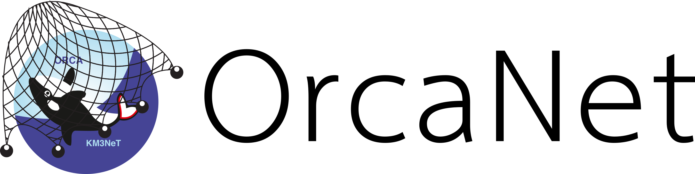

.. OrcaNet documentation master file, created by
   sphinx-quickstart on Tue Nov  6 18:06:28 2018.
   You can adapt this file completely to your liking, but it should at least
   contain the root `toctree` directive.

.. |vspace| raw:: latex

   \vspace{1cm}

|vspace|

.. include:: ../Readme.rst

.. toctree::
   :hidden:
   :maxdepth: 2

   self
   quick_start
   toml_files
   modifiers
   python_overview
   learning_rate
   example_models
   example_on_toy_data
   CONTRIBUTING

Indices and tables
------------------

* :ref:`genindex`
* :ref:`modindex`
* :ref:`search`
